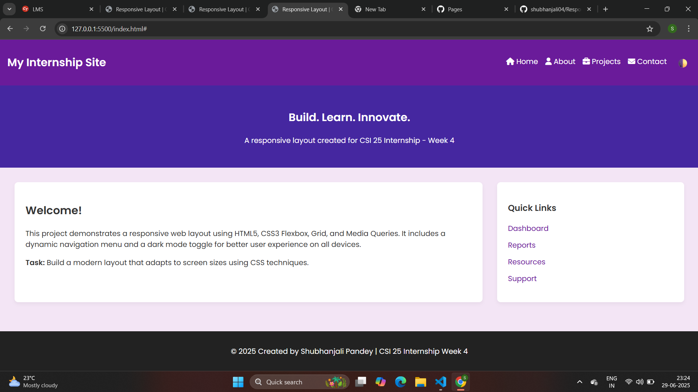

# Responsive Web Layout – CSI 25 Internship (Week 4)

This is my Week 4 submission for the **CSI 25 Internship Program** offered by **Celebal Technologies**. The task focused on designing a clean, responsive, and accessible webpage layout using only **HTML5** and **CSS3**. I implemented Flexbox and Grid to ensure proper structure and responsiveness across screen sizes.

## Project Highlights

- Responsive layout with header, main content, sidebar, and footer
- Mobile-first design using media queries
- Flexbox used for navigation menu
- CSS Grid used to structure content and sidebar
- Custom color theme and typography using Google Fonts
- Styled hover buttons and clean design aesthetics

## Technologies Used

- HTML5
- CSS3 (Flexbox, Grid, Media Queries)
- Google Fonts
- Font Awesome (for icons)

## Live Demo

[View Live Site](https://shubhanjali04.github.io/Responsive-page-layout-CSIweek4/)  

## Screenshot

##  Acknowledgment

I would like to express my gratitude to **Celebal Technologies** and the **CSI 25 Internship Team** for giving me the opportunity to work on this project. Week 4 helped me strengthen my layout and responsive design skills using pure HTML and CSS.

---

## 👤 About Me

**Shubhanjali Pandey**  
GitHub: https://github.com/shubhanjali04)  
Email: shubhanjalipandey32@gmail.com
 
